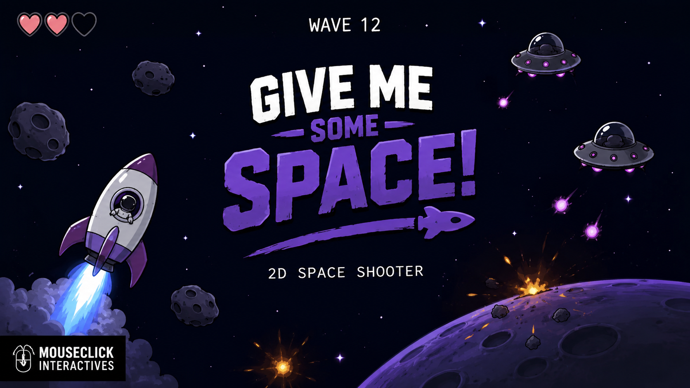
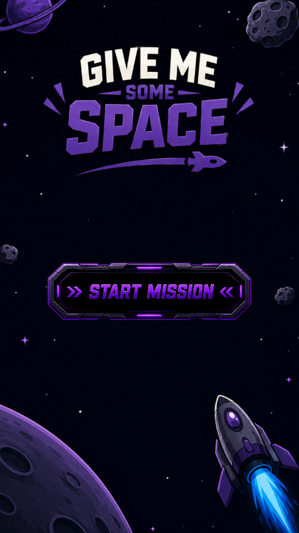
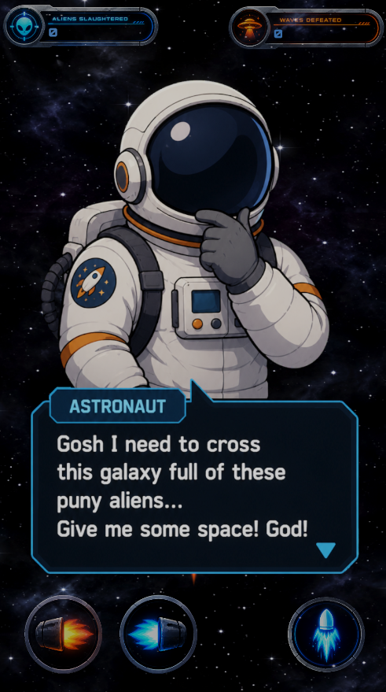
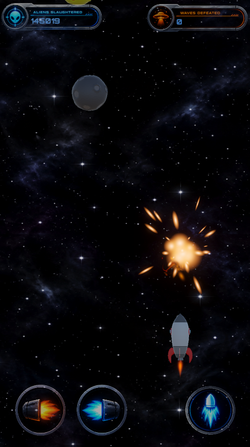
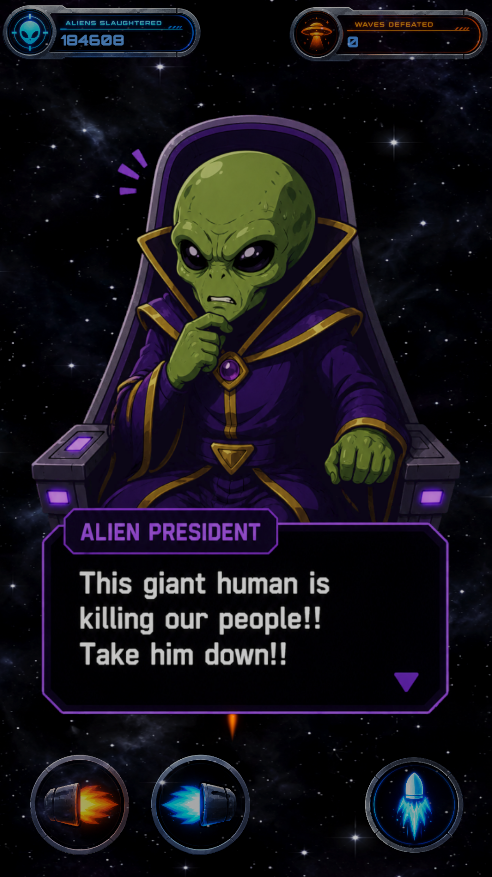
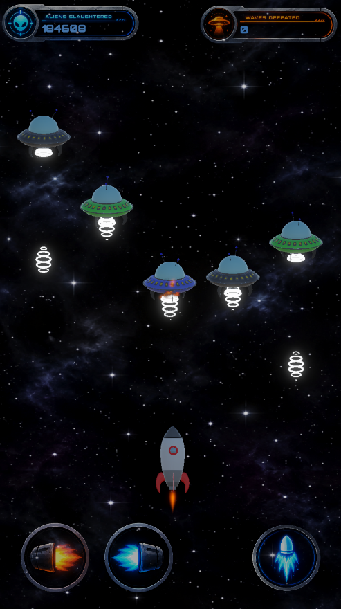
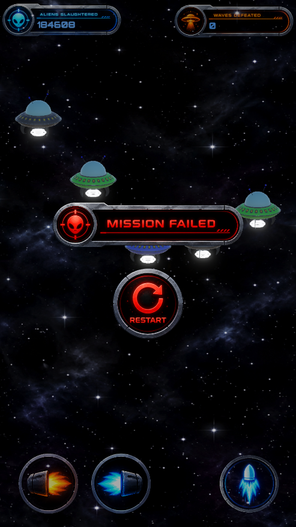

# Give Me Some Space!

Give Me Some Space! is a 3D arcade space shooter built in Unity and designed for mobile, presented from a fixed 2D-style viewpoint.

You play as an astronaut trying to cross a galaxy filled with hostile aliens. What starts as a simple journey quickly turns into a fight against waves of planets and alien UFOs, while the alien president becomes increasingly desperate to stop you.

## Preview

### Watch Gameplay On YouTube(Click The Image)

  

Download From Itch.io : https://moulickpunj.itch.io/give-me-some-space

### Screenshots

  
  
  

  
  
  

## Gameplay

The game is built around short enemy waves and direct, responsive shooting.

Each wave begins with planets moving through the play area. Destroy them to clear the path. Once the planetary wave is finished, an alien UFO squad arrives.

Destroy the entire UFO squad to complete the wave and continue your journey.

After each UFO wave, the game returns to another planetary wave before the next alien squad arrives. The cycle continues as you try to survive for as many waves as possible.

## Combat

The game uses touch-based controls designed around portrait mobile play.

Shooting is accompanied by recoil and impact reactions, while destroyed enemies trigger explosion effects. Enemy movement, recoil and object shaking are handled using frame-rate-independent timing so that gameplay remains consistent across different devices.

The game also includes a restart system and counters for defeated aliens and completed waves.

## Story

The game has a small comic-style story running between the action.

The astronaut is simply trying to cross the galaxy and get through the alien territory. The aliens, however, interpret his arrival rather differently.

After the destruction of their forces, the alien president responds with increasingly desperate orders and sends new UFO squads after the astronaut.

The story is intentionally simple and humorous, with short cutscenes acting as breaks between the gameplay waves.

## Features

- 3D gameplay presented from a fixed 2D-style viewpoint
- Portrait-oriented mobile gameplay
- Touch controls
- Planet and UFO enemy waves
- Multiple UFO variants
- Shooting and recoil effects
- Enemy hit reactions and shaking
- Explosion effects
- Wave progression and counters
- Comic-style story cutscenes
- Restart system
- Frame-rate-independent gameplay effects
- Android build

## Controls

### Mobile

Use the on-screen controls to move and interact with the game.

Tap the screen during cutscenes to continue the dialogue.

## Development

Give Me Some Space! was developed independently using Unity and C# under MouseClick Interactives.

The project was built from the ground up as a small playable game, covering gameplay programming, enemy spawning, wave management, UI, mobile input, resolution handling, animation and effects, cutscene sequencing, Android builds and performance testing across mobile devices.

The game was developed with a focus on keeping the controls responsive, the presentation consistent across different screen sizes and the gameplay effects independent of frame rate.

## Platform

The game is currently available for Android.

## Credits

Developed by Moulick Punj  
MouseClick Interactives

All game programming and development by Moulick Punj.